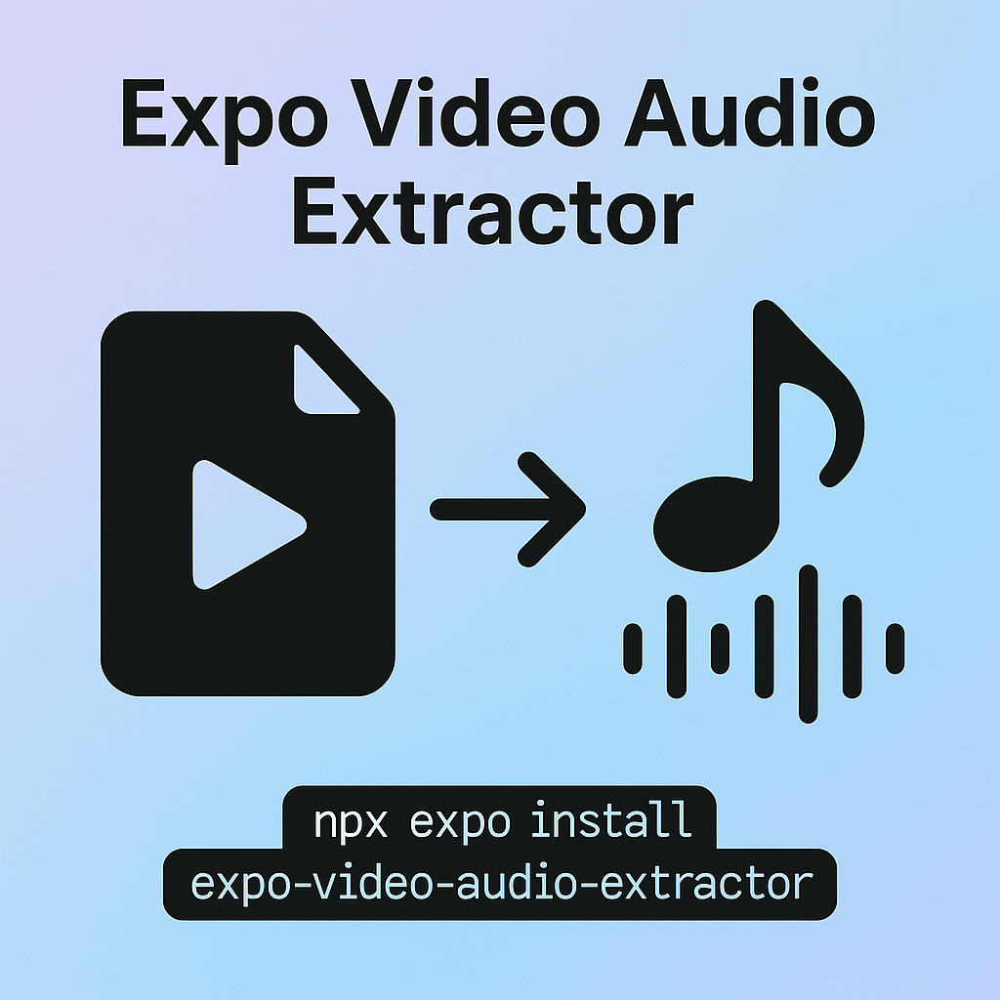

# Expo Video Audio Extractor

[](https://badge.fury.io/js/expo-video-audio-extractor) [](LICENSE)

**On-device audio-only export for React-Native & Expo**

*No FFmpeg • No GPL • Just the platform media APIs — `AVAssetExportSession` (iOS) & `MediaExtractor / MediaMuxer / MediaCodec` (Android)*




## Table of Contents

- [Expo Video Audio Extractor](#expo-video-audio-extractor)
  - [Table of Contents](#table-of-contents)
  - [Features](#features)
  - [Installation](#installation)
  - [Usage](#usage)
    - [API](#api)
  - [Troubleshooting](#troubleshooting)
  - [Contributing](#contributing)
  - [License](#license)

## Features

* **Offline** – runs entirely on-device, no upload required
* **Clean audio export** – grab the soundtrack from any local video
* **Trim & resample** – optional start / duration, sample-rate & channel overrides
* **M4A / WAV output** – lightweight presets accepted everywhere
* **Classic & New Architecture** – works if the host app opts into TurboModule/Fabric later

## Installation

> **Supported React-Native versions:** 0.79 (Expo SDK 53). Older versions may compile but are not tested.

```bash
npx expo install expo-video-audio-extractor
```

That’s it — run a development build or EAS production build and the native module is ready.

> **Local testing:** run `npx expo run:ios` or `npx expo run:android` after installing the library; Expo Go will **not** include the native code.

## Usage

```ts
import { extractAudio } from 'expo-video-audio-extractor';
import * as FileSystem from 'expo-file-system';

const videoUri  = FileSystem.cacheDirectory + 'screen-recording.mov';
const outputUri = FileSystem.documentDirectory + 'speech.m4a';

await extractAudio({
  // Required
  video:  videoUri,
  output: outputUri,

  // Optional controls ↓
  format: 'm4a',      // 'm4a' (default) or 'wav'
  start:  2,          // begin 2 s into the video
  duration: 10,       // export 10 s of audio
  volume: 0.9,        // 90 % volume (linear gain)
  channels: 1,        // force mono (wav only)
  sampleRate: 16000,  // override sample-rate (wav only)
});

console.log('Audio saved at', outputUri);
```

### API

| Option       | Type                    | Default  | Description                                                            |
| ------------ | ----------------------- | -------- | ---------------------------------------------------------------------- |
| `video`      | `string`                | —        | Absolute/local URI to the **input video**                              |
| `output`     | `string`                | —        | Absolute path for the **output audio** (overwritten if already exists) |
| `format`     | `'m4a' \| 'wav'`        | `m4a`    | Output container/codec                                                 |
| `start`      | `number` (seconds)      | `0`      | Offset into the video to begin extraction                              |
| `duration`   | `number` (seconds)      | *to end* | Length of audio to export. Omit to export through the end of the video |
| `volume`     | `number` (`0‒1`)        | `1`      | Linear gain applied to the exported track                              |
| `channels`   | `1 \| 2` (WAV only)     | input    | Force mono or stereo output when exporting WAV                         |
| `sampleRate` | `number` (Hz, WAV only) | input    | Override sample-rate when exporting WAV                                |

**Returns:** `Promise<string>` — absolute file URI of the saved audio.

> ⚠️ `m4a` exports are *passthrough* — the original audio codec (usually AAC) is copied without re-encoding. If you need uniform sample rates or channel layouts, use `wav`.

## Troubleshooting

| Problem                        | Fix                                                                                                 |
| ------------------------------ | --------------------------------------------------------------------------------------------------- |
| **`Native module not linked`** | Rebuild the dev client (`eas build --profile development`) or run `npx expo run-android / run-ios`. |
| **Unsupported format error**   | Only `'m4a'` & `'wav'` are currently implemented.                                                   |
| **Audio length mismatch**      | Check `start` & `duration` values; ensure they reside within the video length.                      |
| **iOS < 12 crash**             | The podspec targets iOS 12+. Older OS versions are not supported.                                   |

## Contributing

PRs are welcome! See [CONTRIBUTING.md](CONTRIBUTING.md) for details.

## License

MIT © 2025 Elliot Fleming

See [LICENSE](LICENSE) for details.
